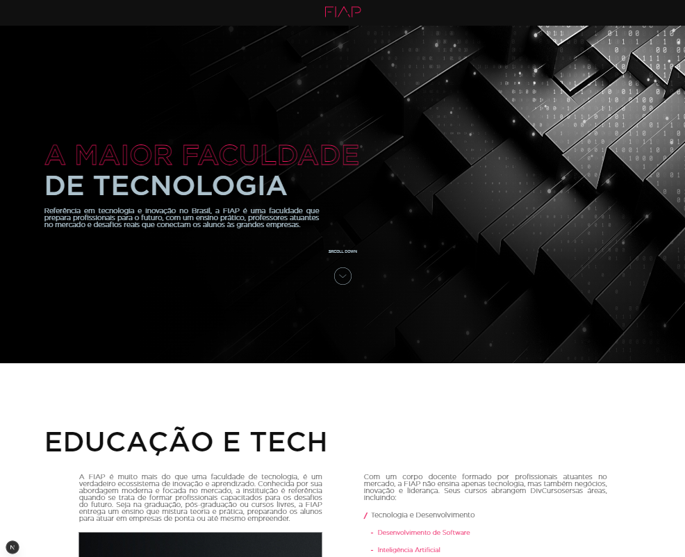

# 🌐 Projeto OnePage FIAP

Uma landing page moderna e responsiva desenvolvida com **Next.js**, **TypeScript**, **Styled Components** e **GSAP** para animações. O projeto simula uma página institucional com foco em usabilidade, performance e experiência visual animada.

---

## 🚀 Tecnologias Utilizadas

- **Next.js** – Framework React para SSR/SSG e performance otimizada  
- **TypeScript** – Superset do JavaScript com tipagem estática  
- **Styled Components** – Estilização com CSS-in-JS e suporte a temas  
- **GSAP (GreenSock Animation Platform)** – Biblioteca de animações para web  
- **React Hooks** – Controle de estado e refs  
- **Responsividade Mobile First** – Compatível com todos os dispositivos

---

## 📸 Imagem do Projeto



---

## 📦 Como Instalar e Rodar Localmente

### 1. Clone o repositório

```bash
git clone https://github.com/acquesta/testeFiap.git
```

### 2. Acesse a pasta do projeto

```bash
cd testeFiap
```

### 3. Instale as dependências

```bash
npm install
# ou
yarn install
```

### 4. Rode o servidor de desenvolvimento

```bash
npm run dev
# ou
yarn dev
```

O projeto estará disponível em: `http://localhost:3000`

---

## 🧾 Funcionalidades

- Navegação suave entre seções
- Animações com GSAP (fade-ins, scroll reveal, accordion)
- Accordion interativo com animações dinâmicas
- Layout totalmente responsivo
- Design moderno e elegante

---

## 🧠 Aprendizados

Durante o desenvolvimento, foram aplicadas boas práticas de:
- Organização de pastas por responsabilidades
- Uso de animações desacopladas via GSAP
- Tipagem segura com TypeScript
- Styled Components com tema centralizado
- Acessibilidade básica com marcação semântica

---

## 📌 Autor

Desenvolvido por Lorenzo Acquesta (https://github.com/acquesta) 💻

---
